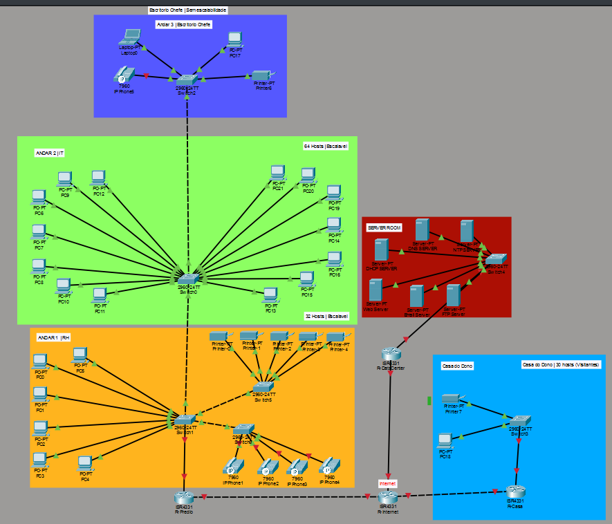

# Projeto de Rede Empresarial — Cisco Packet Tracer

> Simulação de uma rede empresarial completa desenvolvida após a conclusão do curso **Networking Basics** da Cisco Networking Academy.

---

## Descrição do Projeto

Este projeto simula uma rede empresarial real composta por três localizações físicas distintas:

- **Prédio (sede)** — 3 andares com VLANs separadas
- **Server Room** — servidores centralizados com IPs estáticos
- **Casa do Dono** — rede residencial com escalabilidade para visitas

As três localizações estão interligadas via routers ISR4331 através de um router central de Internet, usando **Static Routing**, **NAT Overloading** e **RIPv2**.

---

##  Topologia da Rede





---

##  Equipamentos

| Localização | Equipamento | Modelo | Qtd |
|---|---|---|---|
| Prédio — Andares | Switch | Cisco 2960-24TT | 4 |
| Prédio — Core | Router | 2991 | 1 |
| Server Room | Switch | Cisco 2960-24TT | 1 |
| Server Room | Router | ISR4331 | 1 |
| Casa do Dono | Switch | Cisco 2960-24TT | 1 |
| Casa do Dono | Router | ISR4331 | 1 |
| Internet | Router | ISR4331 | 1 |

> O router Cisco 2911 foi escolhido para o R-Predio por suportar sub-interfaces para inter-VLAN routing (router-on-a-stick) e comandos IOS completos. O ISR4331 foi usado nos restantes routers por ser o modelo padrão em laboratórios CCNA.

---

##  Endereçamento IP — VLSM

O VLSM foi aplicado alocando subnets **do maior para o menor número de hosts**, sem desperdício de endereços.

### Prédio — 192.168.1.0/24

| Ordem | VLAN | Hosts req. | Network | Máscara | Gateway | Broadcast | Hosts úteis |
|---|---|---|---|---|---|---|---|
| 1.º | VLAN 20 — IT | 64 | 192.168.1.0/25 | 255.255.255.128 | 192.168.1.1 | 192.168.1.127 | 126 |
| 2.º | VLAN 10 — RH | 32 | 192.168.1.128/26 | 255.255.255.192 | 192.168.1.129 | 192.168.1.191 | 62 |
| 3.º | VLAN 30 — Chefe | 5 | 192.168.1.192/29 | 255.255.255.248 | 192.168.1.193 | 192.168.1.199 | 6 |
| 4.º | VLAN 40 — VoIP | 4 | 192.168.1.200/29 | 255.255.255.248 | 192.168.1.201 | 192.168.1.207 | 6 |

### Server Room — 192.168.2.0/24

| Servidor | IP Estático | Gateway | Broadcast |
|---|---|---|---|
| DHCP Server | 192.168.2.2 | 192.168.2.1 | 192.168.2.15 |
| DNS Server | 192.168.2.3 | 192.168.2.1 | 192.168.2.15 |
| NTP Server | 192.168.2.4 | 192.168.2.1 | 192.168.2.15 |
| Web Server | 192.168.2.5 | 192.168.2.1 | 192.168.2.15 |
| Email Server | 192.168.2.6 | 192.168.2.1 | 192.168.2.15 |
| FTP Server | 192.168.2.7 | 192.168.2.1 | 192.168.2.15 |

### Casa do Dono — 192.168.3.0/24

| Network | Hosts req. | Máscara | Gateway | Broadcast | Hosts úteis |
|---|---|---|---|---|---|
| 192.168.3.0/27 | 30 (com visitas) | 255.255.255.224 | 192.168.3.1 | 192.168.3.31 | 30 |

### Ligações WAN — Point-to-Point /30

| Ligação | Network | IP lado A | IP lado B | Broadcast |
|---|---|---|---|---|
| R-Predio ↔ R-Internet | 10.0.0.0/30 | 10.0.0.1 | 10.0.0.2 | 10.0.0.3 |
| R-Casa ↔ R-Internet | 10.0.0.8/30 | 10.0.0.9 | 10.0.0.10 | 10.0.0.11 |

> As ligações WAN usam /30 porque numa ligação point-to-point apenas são necessários 2 hosts (os dois routers), evitando desperdício de endereços.

---

##  VLANs e Configuração dos Switches

Todos os switches foram configurados com:

- **Banner MOTD** com aviso de acesso restrito
- **Password enable secret** para acesso ao modo privilegiado
- **Password nas linhas console e VTY**
- **Portas não utilizadas em shutdown** como medida de segurança

| Switch | Localização | VLANs | Portas access | Porta trunk |
|---|---|---|---|---|
| Switch2 | Andar 3 — Chefe | VLAN 30, VLAN 40 | fa0/1–fa0/4 | fa0/5 |
| Switch0 | Andar 2 — IT | VLAN 20 | fa0/1–fa0/15 | fa0/1, fa0/16 |
| Switch1 | Andar 1 — RH | VLAN 10 | fa0/1–fa0/6 | fa0/7, fa0/8, fa0/9, fa0/10 |
| Switch6 | Andar 1 — VoIP | VLAN 40 | fa0/1–fa0/4 | fa0/2 |
| Switch4 | Server Room | VLAN 50 | fa0/1–fa0/7 | fa0/1 |
| Switch3 | Casa do Dono | VLAN 60 | fa0/2, fa0/3 | fa0/1 |

---

##  Acesso Remoto — SSH
 
O dono da empresa consegue gerir o **R-Casa** remotamente via SSH a partir do seu PC (PC18) de forma segura.
 
| Campo | Valor |
|---|---|
| Protocolo | SSH v2 |
| IP de destino | 192.168.3.1 (R-Casa) |
| Username | cisco |
| Autenticação | Login local |
 
Para ativar o SSH foi necessário:
- Definir um hostname (`R-Casa`)
- Configurar um domínio (`ip domain-name empresa.pt`)
- Gerar chaves RSA de 1024 bits (`crypto key generate rsa`)
- Configurar `ip ssh version 2` e `transport input ssh` nas linhas VTY

---
##  Acesso Remoto — SSH
 
O dono da empresa consegue gerir **toda a rede do prédio** remotamente via SSH a partir do **PC18** na Casa do Dono, de forma segura e encriptada.
 
### Dispositivos acessíveis via SSH
 
| Dispositivo | IP de Acesso | Username |
|---|---|---|
| R-Predio | 192.168.1.129 | admin |
| R-Casa | 192.168.3.1 | cisco |
| Switch1 (RH) | 192.168.1.190 | admin |
| Switch0 (IT) | 192.168.1.126 | admin |
| Switch2 (Chefe) | 192.168.1.198 | admin |
 
### Como foi configurado o SSH
 
Em cada dispositivo foi necessário:
 
```
hostname R-Predio
ip domain-name empresa.pt
crypto key generate rsa
! escolher 1024 bits
ip ssh version 2
username admin privilege 15 secret cisco123
line vty 0 4
transport input ssh
login local
exit
```
 
E nos switches foi necessário configurar um **IP de gestão** na VLAN respetiva:
 
```
! Exemplo Switch1
interface Vlan10
ip address 192.168.1.190 255.255.255.192
no shutdown
exit
ip default-gateway 192.168.1.129
```
 
--- 

## Porquê não usar Spanning Tree nem LACP

**Spanning Tree (STP)**
O Cisco 2960 ativa o STP automaticamente — não requer configuração manual. A topologia é em cascata linear (Switch2 → Switch0 → Switch1 → Switch5/6 → R-Predio) sem loops físicos, pelo que o STP manual não é necessário.

**LACP (Link Aggregation)**
O LACP agrega múltiplos cabos entre dois switches para redundância e maior largura de banda. Na topologia atual existe apenas um cabo entre cada par de switches, pelo que não se aplica.

---
 
##  Problemas Encontrados e Soluções
 
### Problema 1 — DHCP Request Failed (Native VLAN)
 
**Sintoma:** Os PCs não recebiam IP via DHCP — o pedido chegava ao R-Predio mas era descartado.
 
**Causa:** A porta trunk entre o Switch1 e o R-Predio tinha a **Native VLAN configurada como VLAN 10** em vez da VLAN 1. O tráfego da VLAN 10 saía sem tag pelo trunk e o router não conseguia associar o pacote à sub-interface correta, descartando-o.
 
**Solução:** Alterar a Native VLAN para 1 (padrão) em todas as portas trunk:
```
interface Fa0/10
switchport trunk native vlan 1
```
 
---
 
### Problema 2 — VLANs não propagadas nos switches em cascata
 
**Sintoma:** O DHCP funcionava no Andar 1 e 2 mas falhava no Andar 3.
 
**Causa:** Os switches em cascata (Switch2 → Switch0 → Switch1) precisam de ter as VLANs de todos os andares criadas localmente. O Switch0 não tinha as VLANs 30 e 40 criadas, por isso o STP bloqueava o tráfego dessas VLANs.
 
**Solução:** Criar as VLANs em todos os switches da cadeia e aplicar `spanning-tree portfast trunk` nas portas trunk:
```
vlan 30
name Chefe
vlan 40
name Telefones
interface Fa0/16
spanning-tree portfast trunk
```
 
---
 
### Problema 3 — NAT a bloquear tráfego interno
 
**Sintoma:** O ping entre o Prédio e a Casa do Dono falhava mesmo com as rotas corretas.
 
**Causa:** O NAT Overloading estava configurado incorretamente no R-Casa — o `ip nat inside source` apontava para a interface errada, traduzindo tráfego interno de forma incorreta.
 
**Solução:** Corrigir o NAT para apontar para a interface WAN correta:
```
no ip nat inside source list 1 interface GigabitEthernet0/0/1 overload
ip nat inside source list 1 interface GigabitEthernet0/0/0 overload
```
 
---

### Problema 4 — Topologia Inicial Incorreta (Server Room via R-Internet)
 
**Sintoma:** Os PCs não recebiam IP via DHCP mesmo com o ip helper-address configurado corretamente no R-Predio.
 
**Causa:** A topologia inicial tinha o R-Datacenter ligado ao R-Internet, ou seja o caminho era **R-Predio → R-Internet → R-Datacenter → DHCP Server**. O NAT Overloading traduzia os IPs privados no R-Internet, fazendo com que os pacotes DHCP chegassem ao servidor com IPs traduzidos e as respostas nunca chegavam ao PC destino corretamente.
 
**Solução:** Redefinir a topologia da rede e ligar o Switch4 do Server Room **diretamente ao R-Predio**, eliminando o R-Datacenter como router intermédio. Desta forma o tráfego DHCP é interno e nunca passa pelo NAT:
 
```
Antes:  R-Predio → R-Internet → R-Datacenter → Switch4 → Servidores
Depois: R-Predio → Switch4 → Servidores
```

---
 
## Limitações do Simulador
 
**VoIP — IP Phones sem configuração**
Os IP Phones 7960 estão presentes na topologia mas não foi possível configurar o serviço de telefonia VoIP (Cisco CME / telephony-service) devido a limitações do Cisco Packet Tracer. O 2911 suporta VoIP em ambiente real com licença UC, mas o Packet Tracer não emula essa funcionalidade. Os IP Phones encontram-se na topologia apenas para representar a arquitetura real da rede.
 
---


##  Certificação

Este projeto foi desenvolvido após a conclusão do curso **Networking Basics** | **Networking Devices and Initial Configuration** da Cisco Networking Academy.


---

*Lucas da Silva — Junho 2026*
